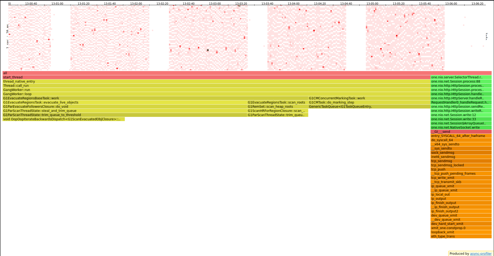
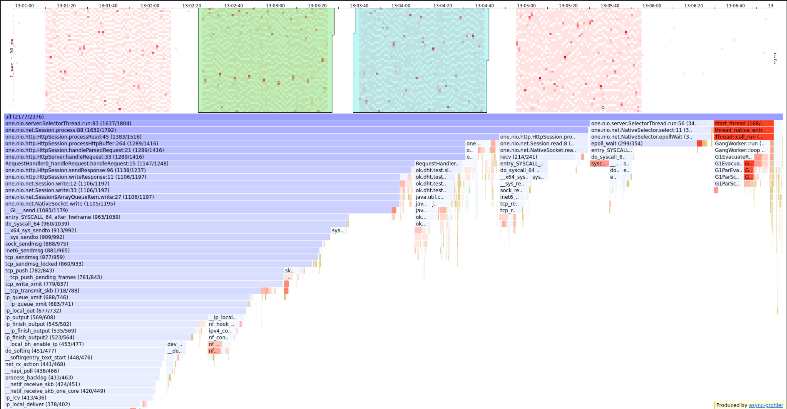
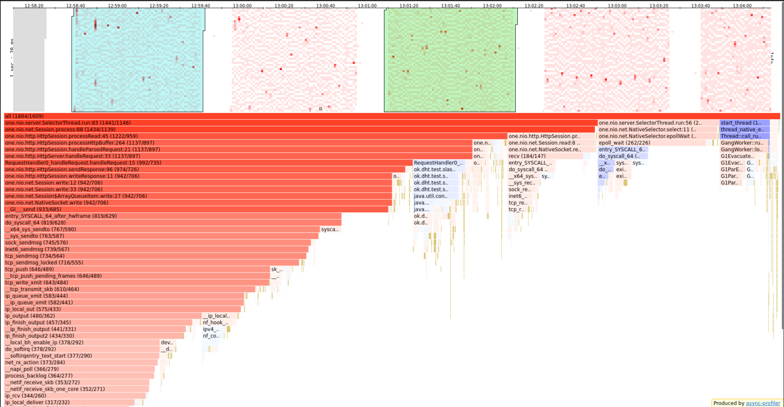
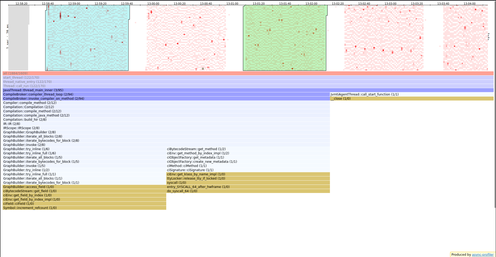
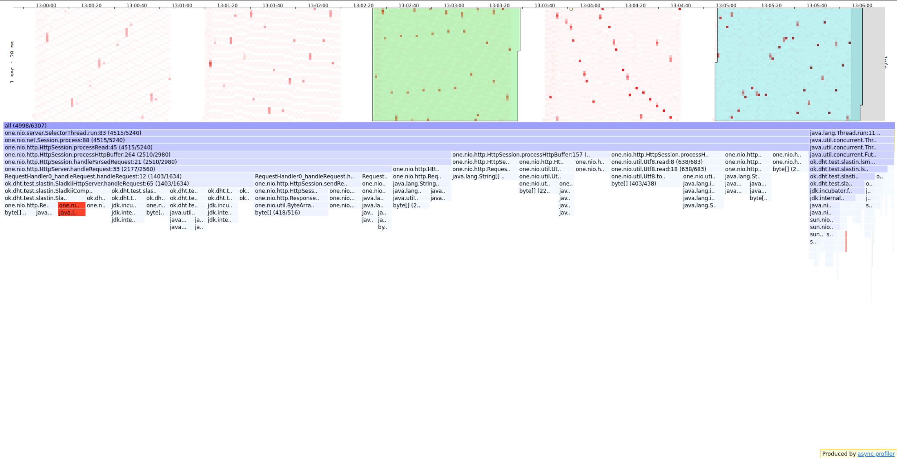
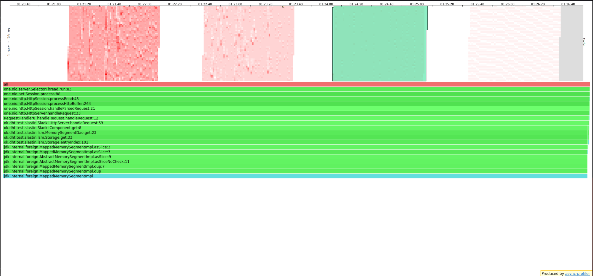
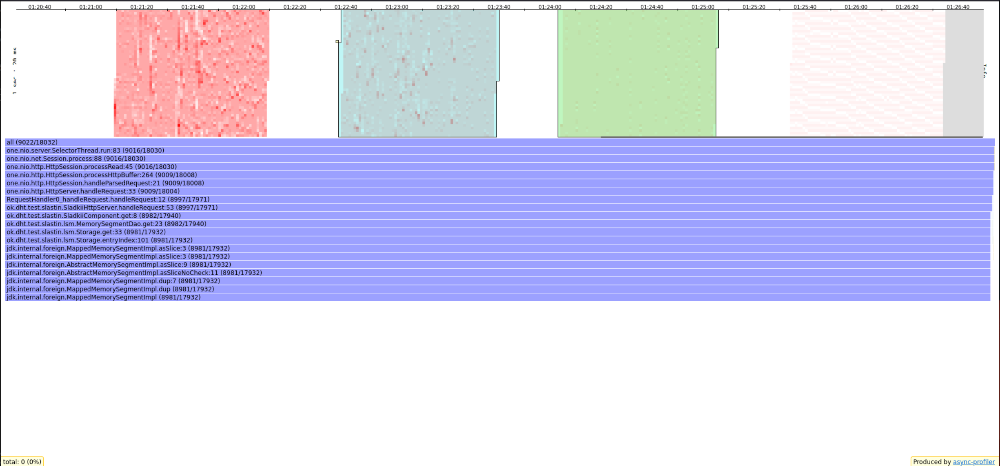

# Отчет (Александр Сластин, ИТМО)

Отчет будет состоять из 3-х частей:
1. Анализ `PUT`
2. Анализ `GET`
3. Общий вывод

Однако прежде чем переходить к анализу проясню пару моментов:
- *Что такое __стабильная нагрузка__?*
  - Как я понял, это такая нагрузка, которая дает приемлемый для нас latency.
  - Для своего сервера выберу приемлемый latency ~ `1ms`, и разрешу отклоняться этому значению в окрестностях `0.5ms`. 
  - То есть, если мы посмотрели, как работает сервер под нагрузкой, и среднее значение latency по нагрузке лежит в отрезке `[0.5, 1.5]` - то нагрузка стабильная, в противном случае - нет.
- *Что значит __наполненная__ БД?* 
  - Под этим буду понимать следующее: __БД наполненная__, если ее данные хранятся не только в кеше / хипе / буфере диска, но еще и на самом диске, чтобы сымитировать высокую нагрузку на приложение.
  - Приложение имеет размер хипа `128Mb`, а локально на машине, на которой поднят сервер, данные хранятся на диске _Samsung 970 EVO Plus 500 ГБ M.2 MZ-V7S500BW_, который имеет размер буфера `512Mb`. Отсюда ясно, что если в БД хранится больше `2Gb` данных, то она будет _наполненной_.

## PUT

Данные для создания запросов буду генерировать с помощью [puts.lua](../wrk2/puts.lua).

### Поиск стабильной нагрузки

Для начала поймем, какой параметр `-R` нужен, чтобы обеспечить стабильную нагрузку на сервер.

 - R = 10000
   - `wrk2 -t1 -c1 -d1m -R10000 -s puts.lua -L http://localhost:2022`
   - Avg Latency = `1.06ms`, Requests/sec: `9999.82`

 - R = 15000
   - `wrk2 -t1 -c1 -d1m -R15000 -s puts.lua -L http://localhost:2022`
   - Avg Latency = `0.88ms`, Requests/sec: `14999.72`

 - R = 20000
   - `wrk2 -t1 -c1 -d1m -R20000 -s puts.lua -L http://localhost:2022`
   - Avg Latency = `600.66us`, Requests/sec: `19999.62`

 - R = 25000
   - `wrk2 -t1 -c1 -d1m -R25000 -s puts.lua -L http://localhost:2022`
   - Avg Latency = `1.47ms`, Requests/sec: `24999.54`

 - R = 27500
   - `wrk2 -t1 -c1 -d1m -R27500 -s puts.lua -L http://localhost:2022`
   - Avg Latency = `11.34ms`, Requests/sec: `27499.64`

 - R = 30000
   - `wrk2 -t1 -c1 -d1m -R30000 -s puts.lua -L http://localhost:2022`
   - Avg Latency = `42.88ms`, Requests/sec: `29999.40`

В каком-то плане значение __R = 25000__ является пороговым - если увеличить кол-во запросов, то latency моментально сильно возрастает и нагрузка перестает быть _стабильной_. Поэтому смело могу объявить, что при __R = 25000__ достигается стабильная нагрузка `PUT`-запросами.

График, на котором изображены показатели latency в зависимости от разной скорости запросов:

`90%` запросов для `puts-25000` имеюют latency не превосходящий `3.01ms`, что обеспечивает стабильную нагрузку.

Также видно, что начиная `27500` latency возрастает в разы.

### Flamegraph

#### CPU

##### Общий взгляд

Посмотрим на общую CPU-нагрузку при __R=25000__:

- ~`73%` уходит суммарно на все сетевые системные вызовы (оранжевые столбцы)
  - `62%` на запись ответа
  - `11%` на чтение
- ~`7%` на сборку мусора (столбец цвета серы)
- ~`6%` на работу DAO, где под капотом `ConcurrentSkipList` параллелит записи

Системные вызовы ускорить не получится - они составляет основную нагрузку, а значит другие части (в частности DAO) делают не слишком много работы, что радует, и показывает, что DAO хорошо справляется с записями данных.

##### Наибольшая нагрузка

Наибольшую нагрузку (красные квадраты) при __R=25000__ составляет сборка мусора (`80%`). Происходит она с практически равной периодичностью после записи флаша DAO на диск.

##### 25000 vs 27500

Сравним как менялось распределение нагрузки при __R=25000__ и __R=27500__:

При __R=25000__ данных приходит меньше, поэтому нагрузку на сеть (синий столбец слева) меньше (синий цвет сигнализирует об этом). Однако, при __R=27500__ сборка мусора занимает меньше времени - об это говорит красный столбец.

Как раз поэтому при __R=27500__ latency возрастает в несколько раз по сравнению с __R=25000__.

##### 15000 vs 10000

Теперь надо понять, почему latency при __R=20000__ меньше, чем при __R=10000__. Сравним нагрузки:

С одной стороны, кажется, что происходит нечто странное - при __R=20000__  больше нагрузки на работу с сетью. Однако, надо не забыть про самый правый синий столбец:

Если присмотреться, то видно, что здесь вступает в игру JIT: при __R=10000__ он активно работает, а при __R=20000__ намного меньше, что и дает выигрыш в latency.

#### ALLOC

##### Общий взгляд

Посмотрим на выделении памяти при __R=25000__:

- ~`10%` выделенной памяти уходит на запись данных в демон потоке на диск
- ~`90%` выделенной памяти происходит внутри `SelectorThread`, который, учитывая однопоточность реализации, и делает запросы к БД, и создает `Response`
  - ~`40%` уходит на конвертацию байт в строку при чтении входного запроса `HttpSession` - это особенность HTTP-запросов, и кажется это сложно улучшить, ведь HTTP - текстовый протокол, поэтому парсинга не избежать. Однако в нашем случае можно было бы сократить кол-во парсинга, учитывая, что мы кладем именно байты в базу.
  - ~`7%` уходит на вызов функции `Request.getPath` - учитывая, что все запросы идут по одному пути - этого парсинга можно было бы избежать, но тогда надо было переписывать класс запросов и сервер
  - ~`12%` уходит каждый раз на создани объекта `Response` вызовом метода `created`. В следующей реализации попробую избежать этой лишней аллокации, создав заранее определенные статические переменные, но тогда надо не забыть переписать `HttpSession`, в частности метод `sendResponse(response)`, который к каждому ответу дописывает лишние хедера вида `"Connection: Keep-Alive"` or `"Connection: close"`
  - ~`16%` уходит на запись в `MemTable`, что ожидаемо

##### 25000 vs 30000

Сравним, какие менялось распределение аллокаций при __R=25000__ и __R=30000__:

Везде ожидаемые изменения с увеличеним числа данных: тратим больше памяти на выгрузку данных на диск, а также обработку запросов.

## GET

Буду искать стабильную нагрузку при наполненной БД (`2.6Gb`) с помощью скрипта [get.lua](../wrk2/get.lua). В базе находятся данные с `id` от 1 до 30000, поэтому запросы не буду обращаться к `id`, которых нет.

### Поиск стабильной нагрузки

 - R = 5000
   - `wrk2 -t1 -c1 -d1m -R5000 -s get.lua -L http://localhost:2022`
   - Avg Latency = `13.34s`, Requests/sec: `3061.09`
   - Сервер умирает, сокращаю объем

 - R = 2500
   - `wrk2 -t1 -c1 -d1m -R2500 -s get.lua -L http://localhost:2022`
   - Avg Latency = `521.96ms`, Requests/sec: `2499.55`

 - R = 2000
   - `wrk2 -t1 -c1 -d1m -R2000 -s get.lua -L http://localhost:2022`
   - Avg Latency = `134.26ms`, Requests/sec: `1999.95`

 - R = 1000
   - `wrk2 -t1 -c1 -d1m -R1000 -s get.lua -L http://localhost:2022`
   - Avg Latency = `8.84ms`, Requests/sec: `999.99`

 - R = 500
   - `wrk2 -t1 -c1 -d1m -R500 -s get.lua -L http://localhost:2022`
   - Avg Latency = `5.84ms`, Requests/sec: `500.01`

 - R = 250
   - `wrk2 -t1 -c1 -d1m -R250 -s get.lua -L http://localhost:2022`
   - Avg Latency = `2.19ms`, Requests/sec: `250.00`

 - R = 100
   - `wrk2 -t1 -c1 -d1m -R100 -s get.lua -L http://localhost:2022`
   - Avg Latency = `2.47ms`, Requests/sec: `100.01`

При __R = 250__ достигается порог после которого среднее latency уже не уменьшается.

Теперь проанализирую с чем связано такое сильное снижение R.

### Flamegraph

#### CPU

Посмотрим на общую CPU-нагрузку при __R=250__:

- ~ `90%` нагрузки составляет обращение к DAO, в частности `70%` идет к диску. Объясняю это тем, что мы обращаемся к данных по случайному id и чаще всего, чтобы найти искомый элемент приходится лезть на диск - отсюда и такое время работы.
- остальное на сеть

Теперь сравним как менялось распределение работы при  __R=250__ и __R=1000__:

Изменилось только кол-во нагрузки на DAO, что весьма логично.

#### ALLOC

`99%` выделение памяти приходится на выгрузка данных из SSTable в MemTable поиск элемента, отгрузку и так далее. Сеть здесь уже практически не участвует.

Теперь сравним распределение выделения памяти при __R=250__ и __R=500__:

Память увеличилась снова в DAO - чем больше запросов, тем больше мы лазим на диск.

## Выводы

С `PUT` база справляется неплохо, сеть основная нагрузка и учитывая, что там уже идут системные вызовы и мы работаем с HTTP, то ее улушчить нельзя. Однако, чтобы справляться с наплывом пользователей в будущем необходимо распаралеллить сервер, переместив обработку запросов из `SelectorThread` в `ExecutorService`. Также можно соптимизировать кол-во аллокаций на возвращение `Response`, что также прикручу.

C `GET` дела обстоят намного хуже - база плохо работает со случайным извлечением по широкому диапазону ключей, который не влезает на диск.
Каждый раз мы вынуждены лезть на диск, причем по несколько раз, чтобы найти искомую запись. Как вариант оптимизации, можно каждому воркеру, который будет в
`ExecutorService` назначить свой range определенных id, чтобы он шел сразу к желанному месту. Также, если мы понимем, что ключи последовательные - 
можно делать не много раз `get`,а сделать `range`-запрос. В целом, зная, что LSM плохо работает с get и учитывая наполненность базы, естественно было
ожидать снижение производительности в это месте, но чтобы настолько - в будущем это надо исправить.