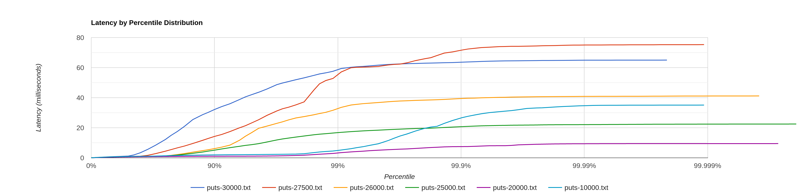
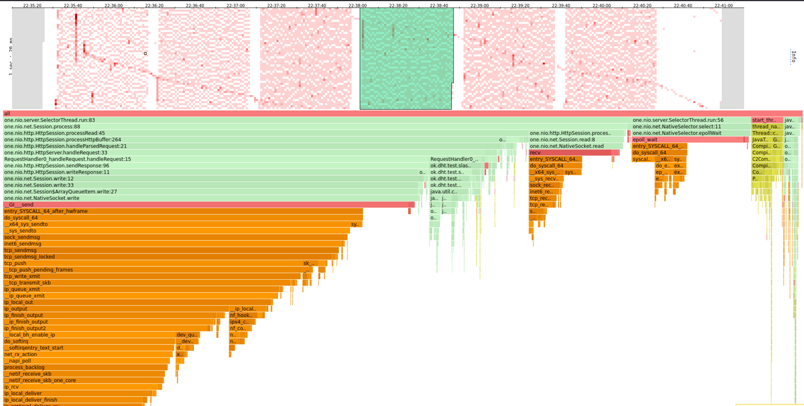
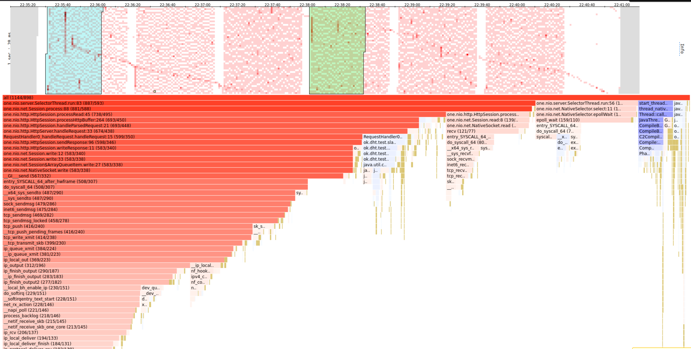
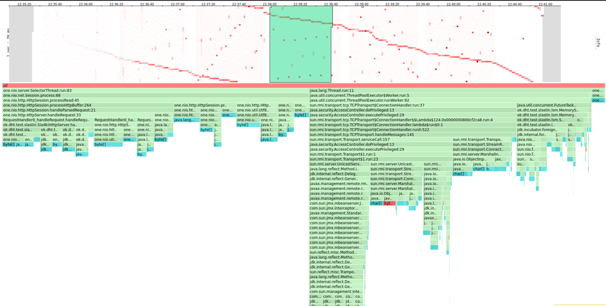
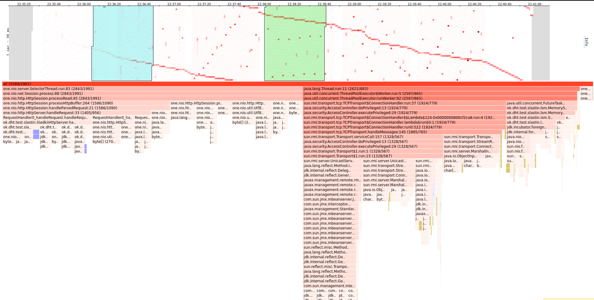
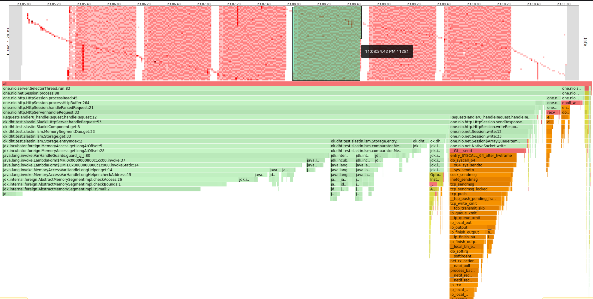
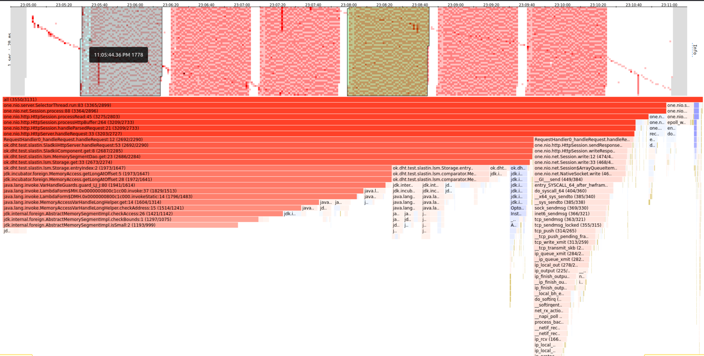
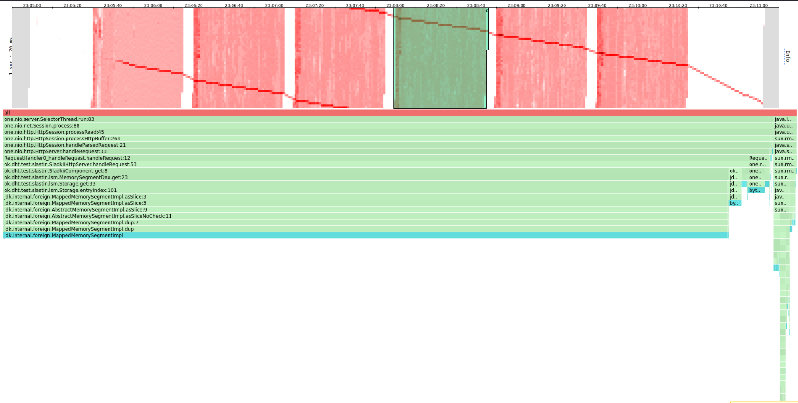
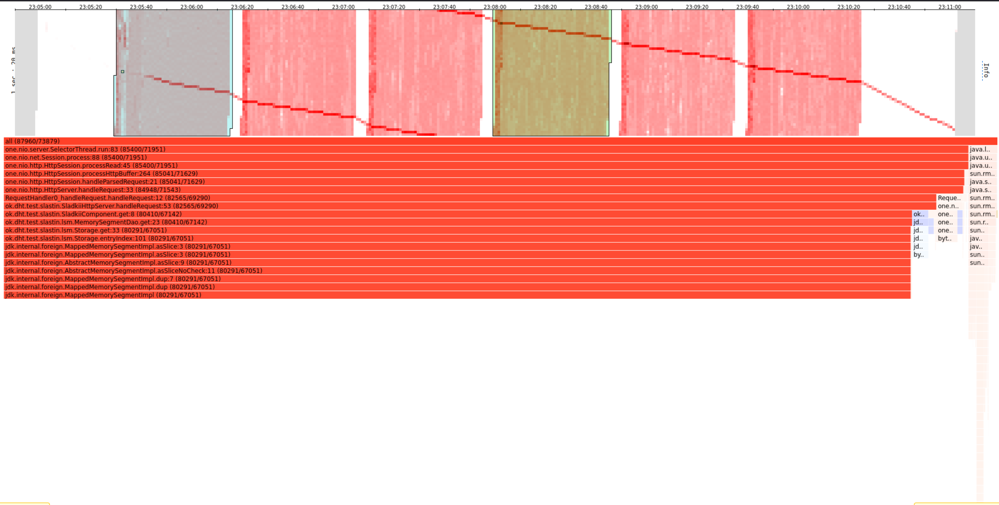

# Отчет

Для начала определим скорость, с которой надо слать запросы, чтобы нагрузка была стабильной. Под стабильной буду считать,
что среднее latency находится в окрестностях 1ms, то есть принадлежит отрезку [0.5; 1.5] ms. Учитывая то, что сервер не
делает никаких сложных вычислений - такой выбор вполне резонен.

Для запуска wrk2 с разными скоростями написал отдельный скрипт [lwrk2.sh](../wrk2/lwrk2.sh) - после его запуска с соответствующими параметрами 
и будем профилировать приложение.

## PUT

Для начала, поймем какой параметр -R нас интересует исходя из требований выше к latency.

В самом начале рассмотрим случай, что тело запроса занимает всего несколько байт (18b). Запустим скрипт
`lwrk2.sh` со следующими аргументами: `bash lwrk2.sh 45s puts 5s` - "делей 45 секунд, используй для генерации запросов к
серверу скрипт `puts.lua`, а между запусками жди 5 секунд". Внутри скрипта запускается wrk2 со скоростями
10000 20000 30000 25000 27500 26000 - кол-во запросов становится меньше, когда нагрузка становится не стабильной - тем
самым получаю, что самый подходящий вариант - 25000 запросов.

Для подтверждения сказанного объединил статистику с запусков wrk2 в один график:

90% данных на зеленом графике имеют latency не превосходящий 1.5 ms.

Теперь проанализируем cpu при стабильной нагрузке:

Работа с БД занимает порядка 15%, где самое тяжелое - выгрузка на диск. 50% - идет на обработку запросов селекторами и
25% на работу с сокетами.

Сранив нагрузку под 25000 и 10000:

Можно увидетьБ что просто увеличилось CPU на запросы, а сам вид работы остался тем же.

Теперь посмотрим на память:

25% на БД, 25% на создание объектов в хипе, например, `Response`. С одной стороны, можно было избежать аллокаций, заведя
статические переменные, но тогда бы latency увеличился, ведь static переменные дороже по времени нежели локальные.
Отставшиеся 50% приходятся на сеть, что вполне ествественно, учитывая кол-во запросов.

Распределение использования памяти также не сильно зависи от нагрузки:

Где должно было стать больше памяти - там и стало.

## GET

Get делаем над наполненной базой (1.2 Gb), проводя запросы wrk2 снова через `lwrk2.sh` со следующими аргументами: `bash lwrk2.sh 45s get 5s`.

Посмотрим на график latency - возвращение запросов занимает куда больше latency нежели положить из базу:

Проанализируем CPU при R=250000:

Теперь порядка 60% нагрузки ложится на базу - вспоминаем, что поиск в LSM - не самая сильная сторона. Остальное ложится
сеть.

Чем больше запросов - тем больше тратим памяти, причем на тех же методах.

БД целиком вытеснила сеть - вся память тратися на поиск элементов, поочередно перетаскивая куски из диска в оперативку и кеш.

И да - чем больше запросов - тем больше памяти - тут снова стабильно.

## Выводы

### PUT

С нагрузкой справляется прилично - вовремя успевает перетащить данные с хипа на диск. Сеть занимает тут больше всего нагрузки,
но этом наверняка пофиксим в следующих занятиях - все же один поток - весьма слабо. Также можно и поступить с сервером,
разрешив параллельно обрабатывать несколько запросов - должно также помочь

### GET

Запросы в БД - выходят долгими - потому что каждый запролс - это последовательный get, а lsm весьма медленен в этом. Для
оптимизации можно отрпавлять range запросы - должно увеличить производительность. Этот момент стоит учесть в будущем, мб объединяя
несколько запросов get в один range-запрос.